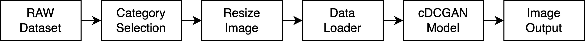
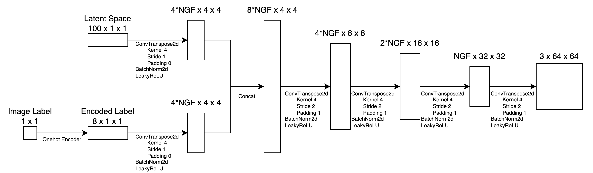

# cDCGAN - ZooAnimals

Implementation of Conditional Deep Concolutional Generative Adverserial Networks (cDCGAN) on Zoo Animals Dataset

# Variables

Terms used in this repository

```py
NC # image channel
IMG_SIZE # image size for training
BATCH_SIZE # training batch size
NZ # num of latent space
NGF # num generator filters
NDF # num discriminator filters
LR # learning rate
BETA1 # beta1 for Adam optimizer
EPOCHS # num of epochs
NGPU # num GPUs
S_SIZE # number of image each category
```

# Dataset Zoo Animals

## Used data

| Category | Num of Image |
|:--------:|:------------:|
|    cat   |     5588     |
|    dog   |     5720     |
|  penguin |     5026     |
|   zebra  |     4068     |
|  giraffe |     1902     |
| elephant |     4112     |
|   sheep  |     5220     |
|  turtle  |     1670     |

We don't use all of these data, we will sample it using `S_SIZE` variable

# Architecture

cDCGAN architecture used in this research

## General architecture



## Generator model




## Discriminator model


# Design Experiments

There are 3 experiments conducted in this research

## Finding best `S_SIZE`, `NGF`, and `NDF`

| ID| S_SIZE| NGF   | NDF   |
|---|-------|-------|-------|
| 1 | 500   | 32    |   32  |
| 2 | 500   | 64    |   64  |
| 3 | 500   | 128   |   128 |
| 4 | 500   | 64    |   128 |
| 5 | 500   | 128   |   64  |
| 6 | 1500  | 32    |   32  |
| 7 | 1500  | 64    |   64  |
| 8 | 1500  | 128   |   128 |
| 9 | 1500  | 64    |   128 |
| 10| 1500  | 128   |   64  |

### Results

|ID | NGF | NDF |S_SIZE| Training Time (s) | Training Time (H:MM:SS) |
|---|-----|-----|------|-------------|---------|
| 1 | 32  | 32  | 500  | 586.0322123 | 0:09:46 |
| 2 | 64  | 64  | 500  | 1021.844561 | 0:17:02 |
| 3 | 64  | 128 | 500  | 2790.996404 | 0:46:31 |
| 4 | 128 | 64  | 500  | 1729.198487 | 0:28:49 |
| 5 | 128 | 128 | 500  | 3557.511505 | 0:59:18 |
| 6 | 32  | 32  | 1500 | 1838.337111 | 0:30:38 |
| 7 | 64  | 64  | 1500 | 2909.312079 | 0:48:29 |
| 8 | 64  | 128 | 1500 | 9269.438068 | 2:34:29 |
| 9 | 128 | 64  | 1500 | 4830.129345 | 1:20:30 |
| 10| 128 | 128 | 1500 | 11109.74546 | 3:05:09 |

Full results available on Google Drive: https://drive.google.com/drive/folders/1qJ4igSl1s2oKNhAF-xq557lUwqv65cIw?usp=sharing 

## Finding best `LR`

We get this as the best model from previous experiment.

|ID | NGF | NDF |S_SIZE| Training Time (s) | Training Time (H:MM:SS) |
|---|-----|-----|------|-------------|---------|
| 10| 128 | 128 | 1500 | 11109.74546 | 3:05:09 |

We conduct experiment with `LR` of `2e-2`, `2e-3`, `2e-4`, and `1e-4`, and get `2e-4` as the best `LR`.

Full code and experiment available on Kaggle: https://www.kaggle.com/code/linkgish/conditional-image-generation-cdcgan-lr-exp 


## Finding best `NZ`

We use our best results from previous experiment, and trying to get best `NZ` size with `NZ` value of 10, 20, 100, and 200. This experiment conclude with 20 as the best `NZ`.

Full code and experiment available on Kaggle: https://www.kaggle.com/linkgish/conditional-image-generation-cdcgan-nz-exp 

# Experiment Conclusion

Based on several experiments and analyzes carried out, this study resulted in the following conclusions.

- Increasing the amount of data, namely the use of `S_SIZE=1500` produces better results than `S_SIZE=1500`.
- The unbalanced use of `NGF` and `NDF` gives unfavorable results, and in the architecture used in this study the role of the amount of `NDF` is more dominant than `NGF`. It is proven by the experiment `NGF=64`, `NDF=128` which gives better results than `NGF=128`, `NDF=64`.
- The results of the experiments for `S_SIZE`, `NGF`, and `NDF` values obtained the best results for `S_SIZE` values of 1500, `NGF=128`, and `NDF=128`.
Experimental results to determine the best LR, at the 100th epoch, the results showed that LR `2e-4` produces better images than `2e-2`, `2e-3`, and `1e-4`. If the `LR` is too high, the model cannot converge, while if the `LR` is too low, the model will take a long time to converge.
- Experimental results for the amount of latent space (`NZ`) show that using `NZ=20` obtains better results than `10`, `100`, and `200`. This indicates that the number of `NZ` affects the generator yield and it is necessary to know the most optimal `NZ` value.
- The best model produced in this experiment with an epoch of 100 and an image size of 64x64x3 is when using `S_SIZE=1500`, `NGF=128`, `NDF=128`, `LR=2e-4`, and `NZ=20`.

# References

```txt
Daberger J., 2023. Zoo animals. Object detection dataset of animals using Pascal VOC labeling format - XML files. https://www.kaggle.com/datasets/jirka- daberger/zoo-animals

Jordan, M.I. and Mitchell, T.M., 2015. Machine learning: Trends, perspectives, and prospects. Science, 349(6245), pp.255-260.
Kostrikov, I., Yarats, D. and Fergus, R., 2020. Image augmentation is all you need: Regularizing deep reinforcement learning from pixels. arXiv preprint arXiv:2004.13649.

Gregor, K., Danihelka, I., Graves, A., Rezende, D. and Wierstra, D., 2015, June. Draw: A recurrent neural network for image generation. In International conference on machine learning (pp. 1462-1471). PMLR.

Goodfellow, I., Pouget-Abadie, J., Mirza, M., Xu, B., Warde-Farley, D., Ozair, S., Courville, A. and Bengio, Y., 2020. Generative adversarial networks. Communications of the ACM, 63(11), pp.139-144.

Mirza, M. and Osindero, S., 2014. Conditional generative adversarial nets. arXiv preprint arXiv:1411.1784.

Radford, A., Metz, L. and Chintala, S., 2015. Unsupervised representation learning with deep convolutional generative adversarial networks. arXiv preprint arXiv:1511.06434.

Mustapha, I.B., Hasan, S., Nabus, H. and Shamsuddin, S.M., 2022. Conditional deep convolutional generative adversarial networks for isolated handwritten arabic character generation. Arabian Journal for Science and Engineering, 47(2), pp.1309-1320.

Zhu, F., He, M. and Zheng, Z., 2020. Data augmentation using improved cDCGAN for plant vigor rating. Computers and Electronics in Agriculture, 175, p.105603.
```
